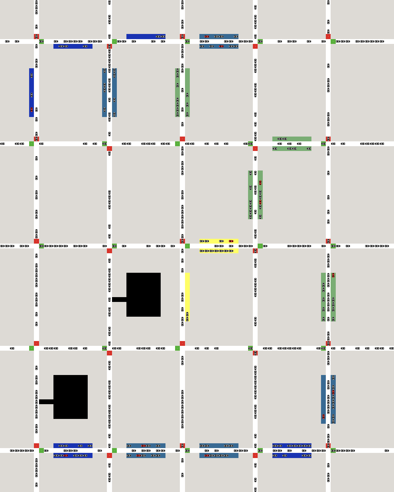

# Modelling Dynamic Pricing Schemes for Parking in Inner Cities: A Reinforcement Learning Approach



The repository at hand allows for the complete replication of all experiments conducted for the master thesis "Modelling Dynamic Pricing Schemes for Parking in Inner Cities: A Reinforcement Learning Approach" by Jakob Gutmann.


## Abstract


> The growing number of vehicles in urban centres around the world is credited with rising congestion and adverse effects
> on public health as well as municipalities’ climate goals. Consequently, an increasing amount of studies,  reflecting cities’ ambitions in this matter, attempt to evaluate the use of more innovative pricing strategies for 
> parking, such as Dynamic Pricing (DP), to efficiently manage parking supply to affect traffic.  However, in this pursuit, existing research has predominantly focused on the direct effects of such schemes on the occupancy of parking spaces 
> in the centre, thereby neglecting their possible indirect impact on the social composition of drivers and traffic flow. Moreover, the potential of utilising Machine Learning (ML) approaches in this setting appears not yet fully explored.
> 
>This paper seeks to contribute to closing these gaps in research by exploring the  effects  of  an  ML  implementation  
> of  DP  for  kerbside  parking  in  inner  cities. For this purpose, as a first step, a theoretical framework embedding the 
> research question into the existing literature on parking policy and pricing was established. Furthermore, to simulate 
> parking in city centres, the Agent-Based Model (ABM) of Aziz et al. (2020) served as a basis and was extensively refined. Building upon this, a Reinforcement Learning (RL) environment was implemented to construct the ML pricing system.  The experiments were then conducted deploying a simple DP baseline and five reward functions designed to emphasise different facets of the overall aims of parking policy.
> 
>The findings of this thesis stress the extensive trade-offs inherent to the pursuit of different policy aims in parking policy as, depending on the reward function utilised, the pricing system often has unintended effects on other policy areas. Thus, these observations highlight the need for any pricing scheme and especially immediately reacting systems,  such as the one implemented here,  to be supplemented with dedicated policy measures to counteract the effects exerted by them beyond their intended function.

## Setup
*Before beginning, make sure to have 
 [NetLogo 6.2](https://ccl.northwestern.edu/netlogo/download.shtml) installed. On Windows, the installation should be detected automatically. Linux users must specify the respective path.
Because some changes had to be made to conduct the experiments, TensorForce is included as a cloned repository in the directory src/external.*
```
# Build Environment
cd project_folder
conda env create -f environment.yml
# Activate Environment
conda activate thesis_gutmann
```

## Using this Repository
There are three main functionalities included in this repository:

**1. Execute the baseline:**
```1
# To run baseline for 50 episodes
cd project_folder/src
python run_baseline.py 50
```

- **episodes** (required): Number of episodes to run the baseline for
- **--[m]odel_size**: Size of the NetLogo grid to use (either "training" or "evaluation"(default))
- **--[n]etlogo_[p]ath**: Path to NetLogo installation (for Linux users only)
- **--gui**: Boolean for NetLogo UI (default False)

All results are written to the baseline subfolder in the experiments directory with a dedicated timestamp to identify them.

**2. Conduct Reinforcement Learning Experiments:**
```
# Train locally for 1,000 episodes on four cores
cd project_folder/src
python run_experiments.py ppo_agent_local.json 1000 -p 4
# Evaluate the policies learned during training (checkpoint must be replaced with timestamp of conducted experiment)
python run_experiments.py ppo_agent_local.json 50 -c 2108-10-0826 --eval --zip
```
- **episodes** (required): Number of episodes to train for
- **agent** (required): Path to agent JSON config file
- **--num_[p]arallel**: CPU cores to use, defaults to 1
- **--[r]eward_key**: Reward function to use ("occupancy" (default), "n_cars", "social", "speed", "composite")
- **--[c]heckpoint**: Checkpoint of previous training process, either used to resume training or for evaluation
- **--[m]odel_size**: Size of the NetLogo grid to use (either "training"(default) or "evaluation")
- **--[n]etlogo_[p]ath**: Path to NetLogo installation (for Linux users only)
- **--batch_agent_calls**: Run agent calls in batches, defaults to False
- **--sync_episodes**: Sync agent calls between parallel episodes, defaults to False
- **--document**: Save plots for min, median and max performances, defaults to True
- **--adjust_free**: Let agent adjust prices freely in interval between 0 and 10, defaults to True
- **--eval**: Run one model instance in evaluation mode, defaults to False
- **--zip**: Zip directory of run after experiment is finished, defaults to False
- **--gui**: Boolean for NetLogo UI (default False)

All results are written to the subfolder of the respective reward function in the experiments directory with a dedicated timestamp to identify them.
The file "ppo_agent_local.json" provides an exemplary agent config file that can be adjusted.

**3. Perform Hperparameter Tuning:**
```
# Tune hyperparameters for 5.400 episodes per iteration, on 36 cores, with two survivors per round
cd project_folder/src
python tune.py -e custom_environment.CustomEnvironment -m 24 -n 5400 -p 36 -rk occupancy -s 2 -r 1,1,1,2,3 -c tune_config.json
```
- **--episodes [n]** (required): Number of episodes to train per iteration
- **--[e]nvironment** (required): TensorForce-Environment (name, configuration JSON file, or library module)
- **--[m]ax_episode_timesteps** (required): Maximum time steps per episode
- **--num_[p]arallel**: CPU cores to use, defaults to 1
- **--[r]eward_[k]ey**: Reward function to use ("occupancy" (default), "n_cars", "social", "speed", "composite")
- **--[c]configfile**: Path to JSON file containing all parameters to be tuned as well as their ranges
- **--[n]etlogo_[p]ath**: Path to NetLogo installation (for Linux users only)
- **--[r]uns-per-round**: Comma-separated number of runs per optimization round, each with a successively smaller number of candidates, defaults to 1,2,5,10
- **[s]election-factor**: Selection factor n, meaning that one out of n candidates in each round advances to the next optimization round, defaults to 3

The result of the tuning process is written to the tuner subfolder. The parameters to tune as well as their ranges can
be adjusted in the "tune_config.json" file.